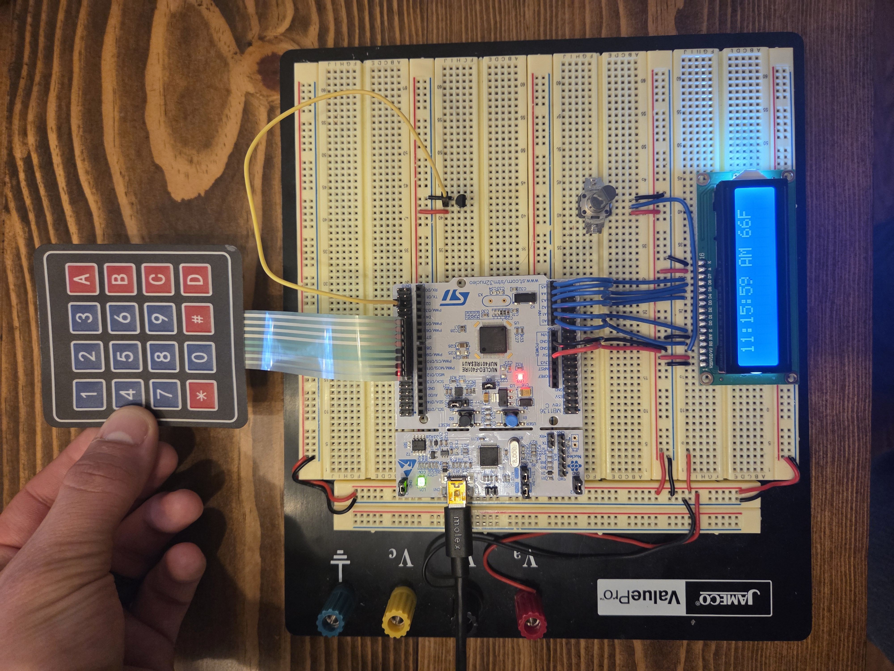
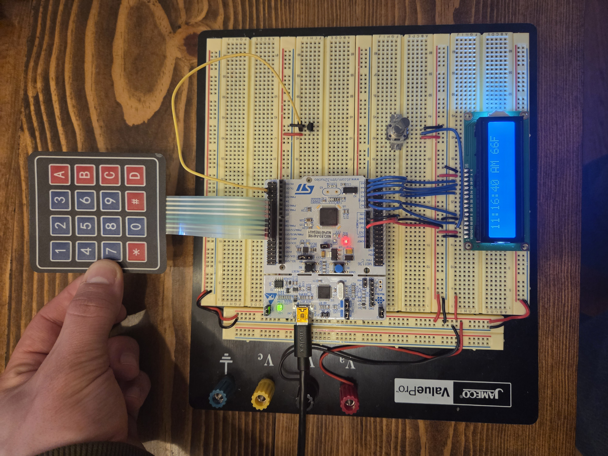

<h1 align="center">
  Welcome to My EE3501 Embedded Systems Final Project! 
</h1>

  TIME AND TEMPERATURE DISPLAY PROJECT

  

  This repository contains the open-source hardware and software for the STM32 time and temperature
  project designed to update and display time and LM35 temperature every second in normal mode. Set mode lets the user enter a new time with the keypad.
Overall this project uses GPIO, keypad scanning, external and timer interrupts, and ADC readings to compute and display temperature in °C or °F.

---

## Design Images

  

  

---
